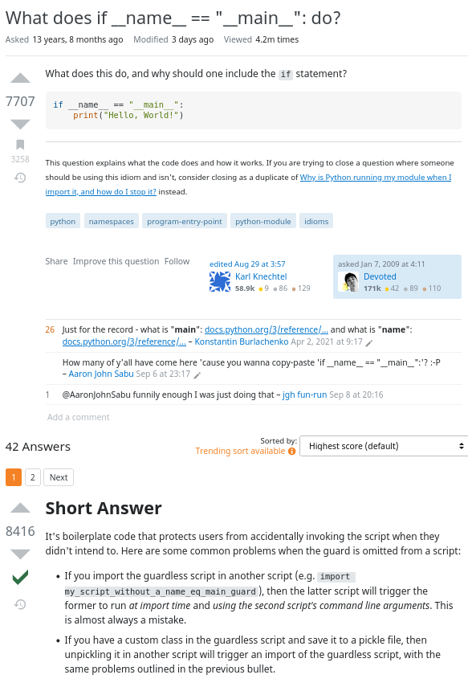
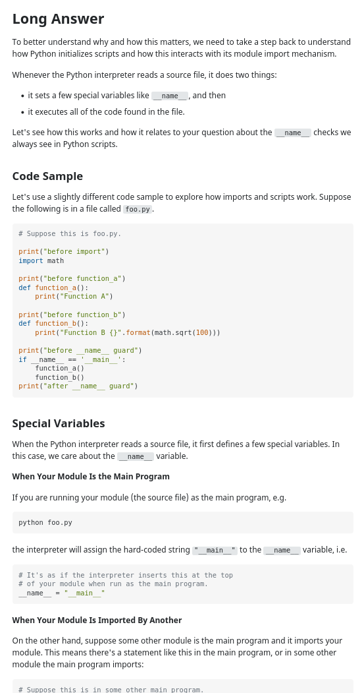
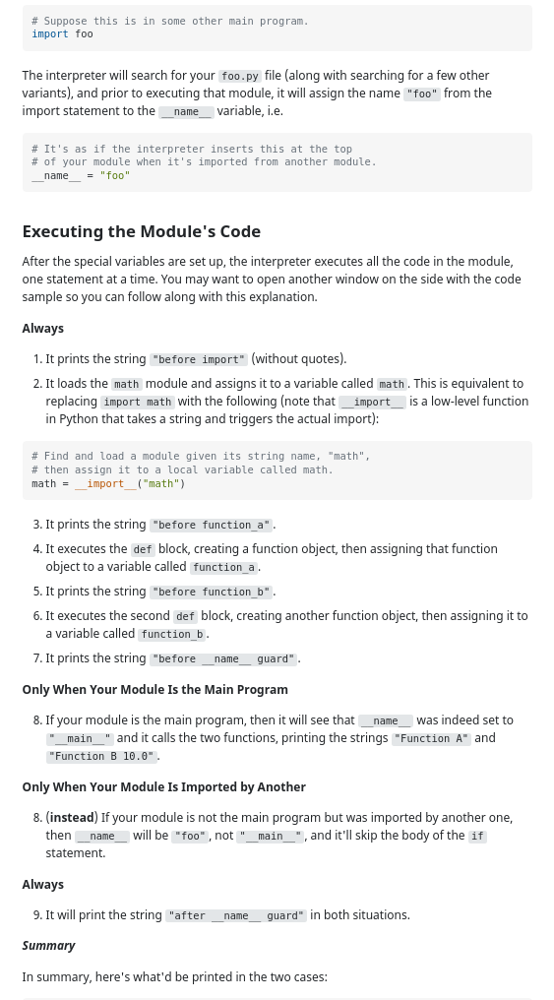
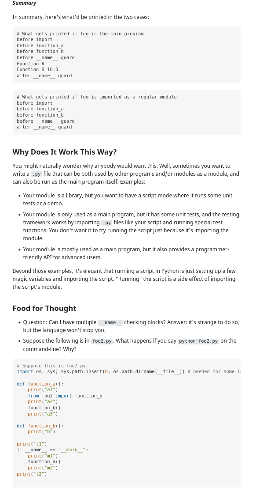
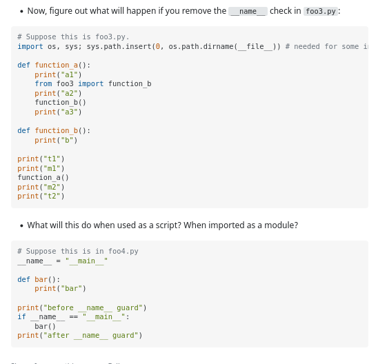

# Learnings

## First class functions

A programming language is said to support first-class functions if it treats functions as first-class objects. Python supports the concept of First Class functions.

Properties of first class functions:

- A function is an instance of the Object type.
- You can store the function in a variable.
- You can pass the function as a parameter to another function.
- You can return the function from a function.
- You can store them in data structures such as hash tables, lists,

### Example: Functions are objects

Python functions are first class objects. In the example below, we are assigning function to a variable. This assignment doesn’t call the function. It takes the function object referenced by shout and creates a second name pointing to it, yell.

```python
# Python program to illustrate functions
# can be treated as objects
def shout(text):
    return text.upper()

print (shout('Hello'))

yell = shout

print (yell('Hello'))
```

### Example: Functions can be passed as arguments to other functions

Because functions are objects we can pass them as arguments to other functions. Functions that can accept other functions as arguments are also called higher-order functions. In the example below, we have created a function greet which takes a function as an argument.

```python
# Python program to illustrate functions
# can be passed as arguments to other functions
def shout(text):
    return text.upper()

def whisper(text):
    return text.lower()

def greet(func):
    # storing the function in a variable
    greeting = func("""Hi, I am created by a function
                    passed as an argument.""")
    print (greeting)

greet(shout)
greet(whisper)
```

### Example: Functions can return another function

Because functions are objects we can return a function from another function. In the below example, the create_adder function returns adder function.

```python
# Python program to illustrate functions
# Functions can return another function

def create_adder(x):
    def adder(y):
        return x+y

    return adder

add_15 = create_adder(15)

print (add_15(10))
```

### Another example on functions as first class functions

```python
# Functions
def add(n1, n2):
    return n1 + n2

def subtract(n1, n2):
    return n1 - n2

def multiply(n1, n2):
    return n1 * n2

def divide(n1, n2):
    return n1 / n2

# Functions are first class objects
def calcluate(calc_func, n1, n2):
    return calc_func(n1, n2)

result_add = calcluate(add, 2, 2)
result_sub = calcluate(subtract, 2, 2)
result_mul = calcluate(multiply, 2, 2)
result_div = calcluate(divide, 2, 2)

print(result_add) # 4
print(result_sub) # 0
print(result_mul) # 4
print(result_div) # 1
```

## Nested functions

Example,

```python
# Nested functions
def outer_function():
    print("I am outer")

    def nested_function():
        print("I am inner")

    nested_function()

outer_function()
```

prints:

```
I am outer
I am inner
```

Example,

```python
# Functions can be returned from other functions
def outer_function_1():
    print("I am outer")

    def nested_function():
        print("I am inner")

    return nested_function

inner_function = outer_function_1()
inner_function()

```

prints:

```
I am inner
```

## Python decorators

Python decorators add extra functionality to functions

Example,

```python
def delay_decorator(function):
    def wrapper_function():
        print("Adding some functionality before function is run")
        time.sleep(1)
        function()
        time.sleep(1)
        print("Adding some functionality before function is run")

    return wrapper_function

@delay_decorator
def say_hello():
    print("Hello")

@delay_decorator
def say_goodbye():
    print("Goodbye")

@delay_decorator
def say_greeting():
    print("How are you?")

delay_decorator(say_hello)()
print('\n')
say_hello()

print("----------\n")

delay_decorator(say_goodbye)()
print('\n')
say_goodbye()
```

prints,

```
Adding some functionality before function is run
Hello
Adding some functionality before function is run

Adding some functionality before function is run
Hello
Adding some functionality before function is run
----------------------
Adding some functionality before function is run
Goodbye
Adding some functionality before function is run

Adding some functionality before function is run
Goodbye
Adding some functionality before function is run
```

Example,

```python
from datetime import datetime

def not_after_office_hours(func):
    def wrapper():
        hour = datetime.now().hour
        if hour <= 17 and hour > 9:
            func()
        else:
            pass

    return wrapper

@not_after_office_hours
def work():
    print("Work Work Work")

work()
```

## Decorating functions with arguments

### Example with no arguments

```python

def do_twice(func):
    def wrapper():
        func()
        func()

    return wrapper

@do_twice
def say_whee():
    print("Whee")

say_whee()
```

prints,

```
Whee
Whee
```

### Example with arguments (Works also without arguments)

```python
def do_twice(func):
    def wrapper(*args, **kwargs):
        func(*args, **kwargs)
        func(*args, **kwargs)

    return wrapper


@do_twice
def greet(name):
    print(f"Hello {name}")


@do_twice
def say_whee():
    print("Whee")

greet("Angela")
say_whee()
```

prints,

```
Hello Angela
Hello Angela
Whee
Whee
```

### Example with function that returns (works also with non-returning function, with ot without arguments)

```python
def do_twice(func):
    def wrapper(*args, **kwargs):
        func(*args, **kwargs)
        return func(*args, **kwargs)

    return wrapper

@do_twice
def greet(name):
    print(f"Hello {name}")

@do_twice
def say_whee():
    print("Whee")

@do_twice
def return_greeting(name):
    print("Creating greeting")
    return f"Hello {name} from return_greeting"

greet("Angela")
say_whee()
greeting = return_greeting("Angela")
print(greeting)
```

prints,

```
Hello Angela
Hello Angela
Whee
Whee
Creating greeting
Creating greeting
Hello Angela from return_greeting
```

## Identity

Introspection is the ability of an object to know about its own attributes at runtime. For instance, a function knows its own name and documentation:

```python
def do_twice(func):
    def wrapper(*args, **kwargs):
        func(*args, **kwargs)
        return func(*args, **kwargs)

    return wrapper


@do_twice
def say_whee():
    print("Whee")

print(say_whee)
print(say_whee.__name__)
print(help(say_whee))
```

prints,

```
<function do_twice.<locals>.wrapper_do_twice at 0x7f43700e52f0>
wrapper
Help on function wrapper in module __main__:

wrapper()
```

However, after being decorated, `say_whee()` has gotten very confused about its identity. It now reports being the `wrapper()` inner function inside the `do_twice()` decorator. Although technically true, this is not very useful information.

To fix this, decorators should use the `@functools.wraps` decorator, which will preserve information about the original function.

```python
import functools

def do_twice(func):

    @functools.wraps(func)
    def wrapper(*args, **kwargs):
        func(*args, **kwargs)
        return func(*args, **kwargs)

    return wrapper

@do_twice
def say_whee():
    print("Whee")

print(say_whee)
print(say_whee.__name__)
print(help(say_whee))
```

prints,

```
<function say_whee at 0x7ff79a60f2f0>
say_whee'
Help on function wrapper in module __main__:

say_whee()
```

## Real life examples

### Usual pattern of decorators

```python
import functools

def decorator(func):
    @functools.wraps(func)
    def wrapper_decorator(*args, **kwargs):
        # Do something before function
        value = func(*args, **kwargs)
        # Do something after function
        return value

    return wrapper_decorator
```

### Timer - Wasting time

It will measure the time a function takes to execute and print the duration to the console. Here’s the code:

```python
import functools
import time


def timer(func):
    """Print the runtime of the decorated function"""

    @functools.wraps(func)
    def wrapper_timer(*args, **kwargs):
        start_time = time.perf_counter()
        value = func(*args, **kwargs)
        end_time = time.perf_counter()
        run_time = end_time - start_time
        print(f"Finished {func.__name__} in {run_time:4f} seconds")
        return value

    return wrapper_timer


@timer
def waste_some_time(num_times):
    for _ in range(num_times):
        sum([i ** 2 for i in range(1000)])


waste_some_time(10)
waste_some_time(100)
waste_some_time(1000)
waste_some_time(10000)
waste_some_time(100000)
```

prints,

```
Finished waste_some_time in 0.002698 seconds
Finished waste_some_time in 0.021087 seconds
Finished waste_some_time in 0.192438 seconds
Finished waste_some_time in 2.021936 seconds
Finished waste_some_time in 22.528309 seconds

```

### Debugging

The following decorator will print the arguments a function is called with as well as its return value every time the function is called:

```python
import functools


def debug(func):
    @functools.wraps(func)
    def wrapper_debug(*args, **kwargs):
        args_repr = [repr(a) for a in args]
        kwargs_repr = [f"{k}={v}" for k, v in kwargs.items()]
        signature = ", ".join(args_repr + kwargs_repr)
        print(f"Calling {func.__name__}({signature})")
        value = func(*args, **kwargs)
        print(f"{func.__name__} returned {value}")
        return value

    return wrapper_debug


@debug
def make_greeting(name, age=None):
    if age is None:
        return f"Howdy {name}!"
    else:
        return f"Whoa {name}! {age} already, you are growing up!"


make_greeting("Benjamin")
make_greeting("Richard", age=112)
make_greeting(name="Dorrisile", age=116)
```

prints,

```
Calling make_greeting('Benjamin')
make_greeting returned Howdy Benjamin!
Calling make_greeting('Richard', age=112)
make_greeting returned Whoa Richard! 112 already, you are growing up!
Calling make_greeting(name=Dorrisile, age=116)
make_greeting returned Whoa Dorrisile! 116 already, you are growing up!
```

### Debugging Python Standard Library Functions

This example also shows how you can apply a decorator to a function that has already been defined.

When calling the `approximate_e()` function, you can see the `@debug` decorator at work:

```python
import functools
import math

def debug(func):
    @functools.wraps(func)
    def wrapper_debug(*args, **kwargs):
        args_repr = [repr(a) for a in args]
        kwargs_repr = [f"{k}={v}" for k, v in kwargs.items()]
        signature = ", ".join(args_repr + kwargs_repr)
        print(f"Calling {func.__name__}({signature})")
        value = func(*args, **kwargs)
        print(f"{func.__name__} returned {value}")
        return value

    return wrapper_debug

factorial = debug(math.factorial)

def approximate_e(terms=18):
    return sum(1 / factorial(n) for n in range(terms))

result = approximate_e(10)
print(result)
```

prints,

```
Calling factorial(0)
factorial returned 1
Calling factorial(1)
factorial returned 1
Calling factorial(2)
factorial returned 2
Calling factorial(3)
factorial returned 6
Calling factorial(4)
factorial returned 24
Calling factorial(5)
factorial returned 120
Calling factorial(6)
factorial returned 720
Calling factorial(7)
factorial returned 5040
Calling factorial(8)
factorial returned 40320
Calling factorial(9)
factorial returned 362880
2.7182815255731922
```

### Slowing down code

Why would you want to slow down your Python code? Probably the most common use case is that you want to rate-limit a function that continuously checks whether a resource—like a web page—has changed. The `@slow_down` decorator will sleep one second before it calls the decorated function:

```python
import functools
import time

def slowdown(func):
    @functools.wraps(func)
    def slowdown_wrapper(*args, **kwargs):
        time.sleep(1)
        value = func(*args, **kwargs)
        return value

    return slowdown_wrapper

@slowdown
def countdown(n):
    if n < 1:
        print("Liftoff")
    else:
        print(f"T minus {n}")
        countdown(n - 1)

countdown(10)
```

prints (and sleeps 1 second between every print),

```
T minus 10
T minus 9
T minus 8
T minus 7
T minus 6
T minus 5
T minus 4
T minus 3
T minus 2
T minus 1
Liftoff

```

### Registering plugins

Decorators don’t have to wrap the function they’re decorating. They can also simply register that a function exists and return it unwrapped. This can be used, for instance, to create a light-weight plug-in architecture.

The `@register` decorator simply stores a reference to the decorated function in the global PLUGINS dict. Note that you do not have to write an inner function or use `@functools.wraps` in this example because you are returning the original function unmodified.

The `randomly_greet()` function randomly chooses one of the registered functions to use. Note that the PLUGINS dictionary already contains references to each function object that is registered as a plugin.

```python
import random

PLUGINS = dict()

def register(func):
    """Register a function as plugin"""
    PLUGINS[func.__name__] = func
    return func

@register
def say_hello(name):
    return f"Hello {name}"

@register
def be_awesome(name):
    return f"Yo {name}, together we are the awesomest!"

def randomly_greet(name):
    greeter, greet_function = random.choice(list(PLUGINS.items()))
    print(f"Using {greeter}")
    return greet_function(name)

greeting = randomly_greet("Alice")
print(greeting)

print(PLUGINS)
```

prints,

```
Using say_hello
Hello Alice
{
  'say_hello': <function say_hello at 0x7f7e7440e4d0>,
  'be_awesome': <function be_awesome at 0x7f7e7440e560>
}

```

If you are familiar with `globals()` in Python, you might see some similarities to how the plugin architecture works. `globals()` gives access to all global variables in the current scope, including your plugins:

```
{
  '__name__': '__main__',
  '__doc__': None,
  '__package__': None,
  '__loader__': <_frozen_importlib_external.SourceFileLoader object at 0x7f7e74521120>,
  '__spec__': None,
  '__annotations__': {},
  '__builtins__': <module 'builtins' (built-in)>,
  '__file__': '/home/mikael/Courses/005-python-100-days/54-flask/deco_ex9.py',
  '__cached__': None,
  'random': <module 'random' from '/usr/lib/python3.10/random.py'>,
  'PLUGINS': {
              'say_hello': <function say_hello at 0x7f7e7440e4d0>,
              'be_awesome': <function be_awesome at 0x7f7e7440e560>
              },
  'register': <function register at 0x7f7e7497fd90>,
  'say_hello': <function say_hello at 0x7f7e7440e4d0>,
  'be_awesome': <function be_awesome at 0x7f7e7440e560>,
  'randomly_greet': <function randomly_greet at 0x7f7e7440e5f0>,
  'greeting': 'Hello Alice'}

```

Using the @register decorator, you can create your own curated list of interesting variables, effectively hand-picking some functions from `globals()`.

### Is the user logged in

The final example before moving on to some fancier decorators is commonly used when working with a web framework. In this example, we are using Flask to set up a /secret web page that should only be visible to users that are logged in or otherwise authenticated:

```python
from flask import Flask, g, request, redirect, url_for
import functools
app = Flask(__name__)

def login_required(func):
    """Make sure user is logged in before proceeding"""
    @functools.wraps(func)
    def wrapper_login_required(*args, **kwargs):
        if g.user is None:
            return redirect(url_for("login", next=request.url))
        return func(*args, **kwargs)
    return wrapper_login_required

@app.route("/secret")
@login_required
def secret():
    ...
```

## Decorating classes

### Decorating class methods

There are two different ways you can use decorators on classes. The first one is very close to what you have already done with functions: you can decorate the methods of a class. This was one of the motivations for introducing decorators back in the day.

Some commonly used decorators that are even built-ins in Python are `@classmethod`, `@staticmethod`, and `@property`. The `@classmethod` and `@staticmethod` decorators are used to define methods inside a class namespace that are not connected to a particular instance of that class. The `@property` decorator is used to customize getters and setters for class attributes. Expand the box below for an example using these decorators.

Let’s define a class where we decorate some of its methods using the `@debug` and `@timer` decorators from earlier:

```python
import functools
import time

def debug(func):
    @functools.wraps(func)
    def wrapper_debug(*args, **kwargs):
        args_repr = [repr(a) for a in args]
        kwargs_repr = [f"{k}={v}" for k, v in kwargs.items()]
        signature = ", ".join(args_repr + kwargs_repr)
        print(f"Calling {func.__name__}({signature})")
        value = func(*args, **kwargs)
        print(f"{func.__name__} returned {value}")
        return value

    return wrapper_debug

def timer(func):
    """Print the runtime of the decorated function"""

    @functools.wraps(func)
    def wrapper_timer(*args, **kwargs):
        start_time = time.perf_counter()
        value = func(*args, **kwargs)
        end_time = time.perf_counter()
        run_time = end_time - start_time
        print(f"Finished {func.__name__} in {run_time:4f} seconds")
        return value

    return wrapper_timer

class TimeWaster:
    @debug
    def __init__(self, max_num):
        self.max_num = max_num

    @timer
    def waste_time(self, num_times):
        for _ in range(num_times):
            sum([i ** 2 for i in range(self.max_num)])

tw = TimeWaster(1000)
tw.waste_time(999)
```

prints,

```
Calling __init__(<__main__.TimeWaster object at 0x7f7af1c17d60>, 1000)
__init__ returned None
Finished waste_time in 0.192787 seconds
```

### Decorating whole classes

The other way to use decorators on classes is to decorate the whole class. This is, for example, done in the new dataclasses module in Python 3.7:

```python
from dataclasses import dataclass

@dataclass
class PlayingCard:
    rank: str
    suit: str
```

The meaning of the syntax is similar to the function decorators. In the example above, you could have done the decoration by writing PlayingCard = dataclass(PlayingCard).

A common use of class decorators is to be a simpler alternative to some use-cases of metaclasses. In both cases, you are changing the definition of a class dynamically.

Writing a class decorator is very similar to writing a function decorator. The only difference is that the decorator will receive a class and not a function as an argument. In fact, all the decorators you saw above will work as class decorators. When you are using them on a class instead of a function, their effect might not be what you want. In the following example, the @timer decorator is applied to a class:

Decorating a class does not decorate its methods. Recall that @timer is just shorthand for TimeWaster = timer(TimeWaster).

Here, @timer only measures the time it takes to instantiate the class:

```python
>>> tw = TimeWaster(1000)
Finished 'TimeWaster' in 0.0000 secs

>>> tw.waste_time(999)
```

Later, you will see an example defining a proper class decorator, namely @singleton, which ensures that there is only one instance of a class.

## Nesting decorators

You can apply several decorators to a function by stacking them on top of each other.

Think about this as the decorators being executed in the order they are listed. In other words, `@debug` calls `@do_twice`, which calls `greet()`, or `debug(do_twice(greet()))`.

Observe the difference if we change the order of @debug and @do_twice:

```python
from all_decorators import debug, do_twice

@debug
@do_twice
def greet1(name):
    print(f"Hello {name}")

@do_twice
@debug
def greet2(name):
    print(f"Hello {name}")

greet1("Angela")
greet2("Angela")
```

prints,

```
Calling greet1('Angela')
Hello Angela
Hello Angela
greet1 returned None
------------------
Calling greet2('Angela')
Hello Angela
greet2 returned None
Calling greet2('Angela')
Hello Angela
greet2 returned None
```

## Decorators with arguments

Sometimes, it’s useful to pass arguments to your decorators. For instance, `@do_twice` could be extended to a `@repeat(num_times)` decorator. The number of times to execute the decorated function could then be given as an argument.

So far, the name written after the `@` has referred to a function object that can be called with another function. To be consistent, you then need `repeat(num_times=4)` to return a function object that can act as a decorator.

Typically, the decorator creates and returns an inner wrapper function, so writing the example out in full will give you an inner function within an inner function.

This `wrapper_repeat()` function takes arbitrary arguments and returns the value of the decorated function, `func()`. This wrapper function also contains the loop that calls the decorated function `num_times` times. This is no different from the earlier wrapper functions you have seen, except that it is using the `num_times` parameter that must be supplied from the outside.

One step out, you’ll find the decorator function. Again, `decorator_repeat()` looks exactly like the decorator functions you have written earlier, except that it’s named differently. That’s because we reserve the base `name—repeat()`—for the outermost function, which is the one the user will call.

As you have already seen, the outermost function returns a reference to the decorator function. There are a few subtle things happening in the `repeat()` function:

- Defining `decorator_repeat()` as an inner function means that `repeat()` will refer to a function object—decorator_repeat. Earlier, we used repeat without parentheses to refer to the function object. The added parentheses are necessary when defining decorators that take arguments.

- The `num_times` argument is seemingly not used in repeat() itself. But by passing `num_times` a closure is created where the value of `num_times` is stored until it will be used later by `wrapper_repeat()`.

With everything set up, let’s see if the results are as expected:

```python
import functools

def repeat(num_times):
    def decorator_repeat(func):
        @functools.wraps(func)
        def wrapper_repeat(*args, **kwargs):
            for _ in range(num_times):
                value = func(*args, **kwargs)
            return value

        return wrapper_repeat

    return decorator_repeat

@repeat(num_times=4)
def greet(name):
    print(f"Hello {name}")

greet("Angela")
```

prints,

```
Hello Angela
Hello Angela
Hello Angela
Hello Angela
```

### Decorators that can be used both with and without arguments

As you saw in the previous section, when a decorator uses arguments, you need to add an extra outer function. The challenge is for your code to figure out if the decorator has been called with or without arguments.

Since the function to decorate is only passed in directly if the decorator is called without arguments, the function must be an optional argument. This means that the decorator arguments must all be specified by keyword. You can enforce this with the special `*` syntax, which means that all following parameters are keyword-only.

Here, the `_func` argument acts as a marker, noting whether the decorator has been called with arguments or not:

- If name has been called without arguments, the decorated function will be passed in as `_func`. If it has been called with arguments, then `_func` will be `None`, and some of the keyword arguments may have been changed from their default values. The `*` in the argument list means that the remaining arguments can’t be called as positional arguments.

- In this case, the decorator was called with arguments. Return a decorator function that can read and return a function.

- In this case, the decorator was called without arguments. Apply the decorator to the function immediately.

Compare this with the original `@repeat`. The only changes are the added `_func` parameter and the if-else at the end.

```python
import functools

def repeat(_func=None, *, num_times=2):
    def decorator_repeat(func):
        @functools.wraps(func)
        def wrapper_repeat(*args, **kwargs):
            for _ in range(num_times):
                value = func(*args, **kwargs)
            return value

        return wrapper_repeat

    if _func is None:
        return decorator_repeat
    else:
        return decorator_repeat(_func)

@repeat
def say_whee():
    print("Whee!")

@repeat(num_times=3)
def greet(name):
    print(f"Hello {name}")

say_whee()
greet("Penny")
```

prints,

```
Whee!
Whee!
Hello Penny
Hello Penny
Hello Penny
```

## Flask

Flask example,

```python
from flask import Flask
import time

app = Flask(__name__)


@app.route("/")
def hello_world():
    return "<h1>Hello World!</h1>"


@app.route("/bye-bye")
def good_bye():
    return "<h1>Goodbye!</h1>"


if __name__ == "__main__":
    print(time.__name__)  # time - Name of module
    print(__name__)  # __main__ - prints main in case this file is run

    app.run()

```

## Why `if __name__ == "__main__":`










